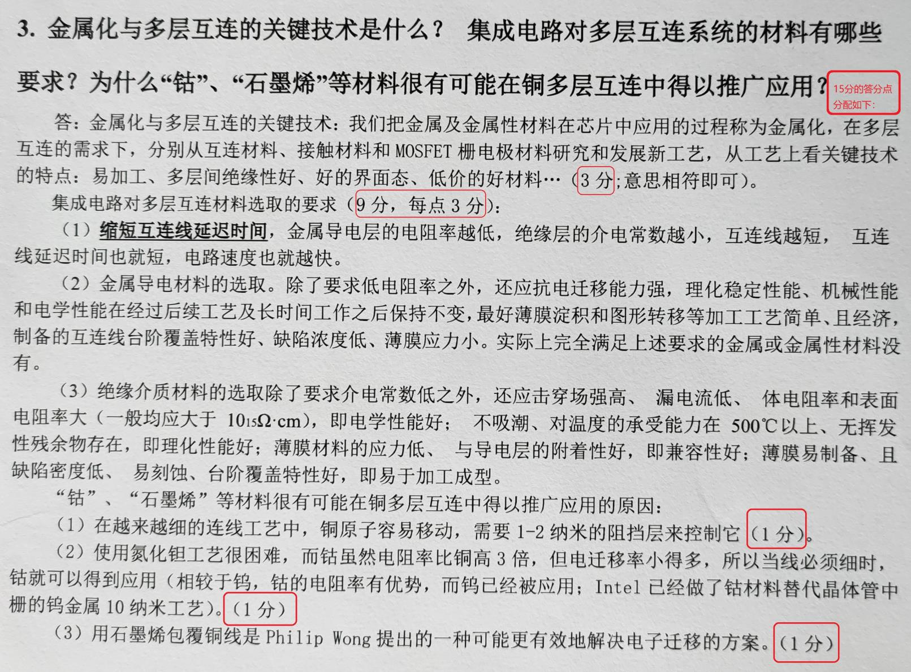

# 综合分析题

## 第一单元 硅衬底

教师点评（供参考） ： “晶体” 原理指导下备片工艺， 低成本、 高成品、 自动化
下的工艺和设备

### 1. 硅单晶锭 CZ、 MCZ 和 FZ 三种生长方法的特点及适用范围？

CZ: 直拉; MCZ: 磁控直拉; FZ: 悬浮区熔融

- CZ法工艺成熟可拉制大直径硅锭，但受坩锅熔融带来的O等杂质浓度高，存在一定杂质分布，因此，相对于MCZ和FZ法，生长的硅锭质量不高。当前仍是生产大直径硅锭的主要方法。
- MCZ法是在CZ技术基础上发展起来的，生长的单晶硅质量更好，能得到均匀、低氧的大直径硅锭。但MCZ设备较CZ设备复杂得多，造价也高得多，强磁场的存在使得生产成本也大幅提高。MCZ法在生产高品质大直径硅锭上已成为主要方法。
- FZ法与CZ、MCZ法相比，去掉了坩埚，因此没有坩埚带来的污染，能拉制出更高纯度、无氧的高阻硅，是制备高纯度，高品质硅锭，及硅锭提存的方法。但因存在熔融区因此拉制硅锭的直径受限。FZ法硅锭的直径比CZ、MCZ法小得多。

## 第二单元 氧化与掺杂

教师点评（供参考）： SiO~2~膜的厚度、 质量及相关的检测很重要； 低温、 按比例缩小下的工艺需求！

### 2. 欲对扩散的杂质起有效的屏蔽作用，对SiO~2~膜（与氮化硅薄膜比较） 有何要求？工艺上如何控制氧化膜生长质量？什么是沟道效应？如何才能避免？

- 参见 ***4.1.5 二氧化硅的掩蔽作用 Page 62.***

  - 硅衬底上的SiO~2~若要能够当作掩膜来实现定域扩散的话，就应该要求杂质在SiO~2~层中的扩散深度$x_j$小于SiO~2~本身的厚度$x_{SiO_2}$，即有
    $$
    x_j<x_{SiO_2}
    $$

  - 实际上只有对那些$D_{SiO_2}<D_{Si}$，即$D_{Si}/D_{SiO_2}>1$的杂质，用 SiO~2~ 膜掩蔽才有实用价值。

  - **SiO~2~掩膜最小厚度确定**  硅衬底上的SiO~2~要能够当作掩膜来实现定域扩散的话, **balabalabala** 可保证SiO~2~膜能起到有效的掩蔽作用。

  - 若取 $C_s/C_I=10^3$，则所需氧化层的最小厚度为
    $$
    x_{min}=4.6\sqrt{D_{SiO_2}t}
    $$

  - 与氮化硅薄膜的比较参见 ***7.5.1 氮化硅薄膜性质与用途 Page 171***

- 参见 ***4.5.2 SiO~2~层成膜质量的测量 Page 82***.

- 参见 ***6.3.3 单晶靶中的沟道效应 Page 123***.

  - 对晶体靶进行离子注入时，当离子注入的方向与靶晶体的某个晶向平行时，其运动轨迹将不再是无规则的，而是将沿沟道运动并且很少受到原子核的碰撞，因此来自靶原子的阻止作用要小得多，而且沟道中的电子密度很低，受到的电子阻止也很小，这些离子的能量损失率就很低。在其他条件相同的情况下，很难控制注入离子的浓度分布，注入深度大于在无定形靶中的深度并使注入离子的分布产生一个很长的拖尾，注入纵向分布峰值与高斯分布不同，这种现象称为离子注入的沟道效应（Channeling effect）。

  - **减少沟道效应的措施**：

    1. 对大的离子，沿沟道轴向 (110) 偏离 7-10°

    2. 用 Si，Ge，F，Ar 等离子注入使表面预非晶化，形成非晶层（Pre-amorphization）

    3. 增加注入剂量（晶格损失增加，非晶层形成，沟道离子减少）

    4. 表面用 SiO~2~ 层掩膜。

### 3. 对 n 区进行 p 扩散，使 $C_S=1000C_B$ ，证明：假定是恒定源扩散，结深与$(DT)^{1/2}$成正比，请确定比例因子。

参见 ***5.3.1 恒定表面源扩散 Page 94***

最终结果
$$
A=2\mathrm{erfc}^{-1}\frac{C_B}{C_S}=2\mathrm{erfc}^{-1}\frac{1}{1000}\approx 9.2
$$

## 第三单元 薄膜制备

教师点评（供参考） ： 薄膜制作中化学手段的优势？ 低温、 快速、 可靠！

### 4. 比较 APCVD、 LPCVD 和 PECVD 三种方法的主要异同？主要优缺点？淀积 Si~3~N~4~ 薄膜的化学反应式和淀积条件?

- 主要异同和优缺点
  - 从三种方法的工艺原理上看，APCVD、LPCVD是热激活并维持化学反应发生，而PECVD是采用电能将反应气体等离子化从而热激活并维持化学反应发生的。
  - APCVD工艺温度一般控制在气相质量输运限制区，采用冷壁式反应器，在薄膜淀积过程中应精确控制反应剂成分、计量和气相质量输运过程。主要缺点是有气相反应形成的颗粒物。
  - LPCVD工艺温度一般控制在表面反应限制区，对反应剂浓度的均匀性要求不是非常严格，对温度要求严格。因此多采用热壁式反应器，衬底垂直放置，装载量大，更适合大批量生产，气体用量少，功耗低，降低了生产成本。颗粒污染现象也好于APCVD。
  - PECVD工艺是典型的表面反应速率控制淀积方法，需要精确控制衬底温度。最大特点是工艺温度较低，所淀积薄膜的台阶覆盖性、附着性也好于APCVD和PECVD。但薄膜一般含有氢等气体副产物，质地较疏松，密度低。

- 参见 ***7.5 氮化硅薄膜淀积 Page 171*** .

### 5. 等离子体是如何产生的？ PECVD 是如何利用等离子体的？ PEVCD 法为何能在较低温度淀积氮化硅薄膜?

- 对低压气体施加电场时，出现辉光放电现象，气体被击穿，有一定的导电性，这种具有一定导电能力的气态混合物是由正离子、电子、光子以及原子、原子团、分子和它们的激发态所组成的，被称为等离子体。

- PECVD是采用等离子体技术把电能耦合到反应气体中，激活并维持化学反应进行，从而淀积薄膜的一种工艺方法。
- 利用等离子体技术能提高化学反应速度，进而降低化学反应对温度的敏感，使之在较低温度下进行薄膜淀积。

### 6. 以铝互连系统作为一种电路芯片的电连系统时，若分别采用真空蒸镀和磁控溅射工艺淀积铝膜，应分别从哪几方面来提高其台阶覆盖特性？

- 真空蒸镀铝膜通过衬底加热和衬底旋转来改善其台阶覆盖特性。

- 磁控溅射通过提高衬底温度，在衬底上加射频偏压，采用强迫填充技术，采用准直溅射技术。

## 第四单元 光刻

教师点评（供参考） ： 了解光刻的困惑； 卡脖子设备的关键工艺； 刻蚀原理

### 7. 光学分辨率增强技术有那些？紫外光的常见曝光方法有那些？后光刻时代有那些光刻技术？

### 8. 在光刻技术中，为什么常用保真度、选择比、均匀性来衡量刻蚀的精度？请说出“保真度”、“选择比”的含义。

### 9. 在刻蚀技术中，常用保真度、选择比、均匀性来衡量刻蚀精度，试阐述干法刻蚀的优势？

## 第五单元 工艺集成与封装测试

教师点评（供参考） ： 连线及其上信号延迟、 SI（信号完整性）、 管子及互连工艺中上万个发明的专利池！

### 10.合金工艺与多层互连的关键技术是什么？ 集成电路对多层互连系统的要求是什么？ 最新的发展和趋势是什么（下一代为什么可能是“钴”、“石墨烯”在铜布线中应用） ？

