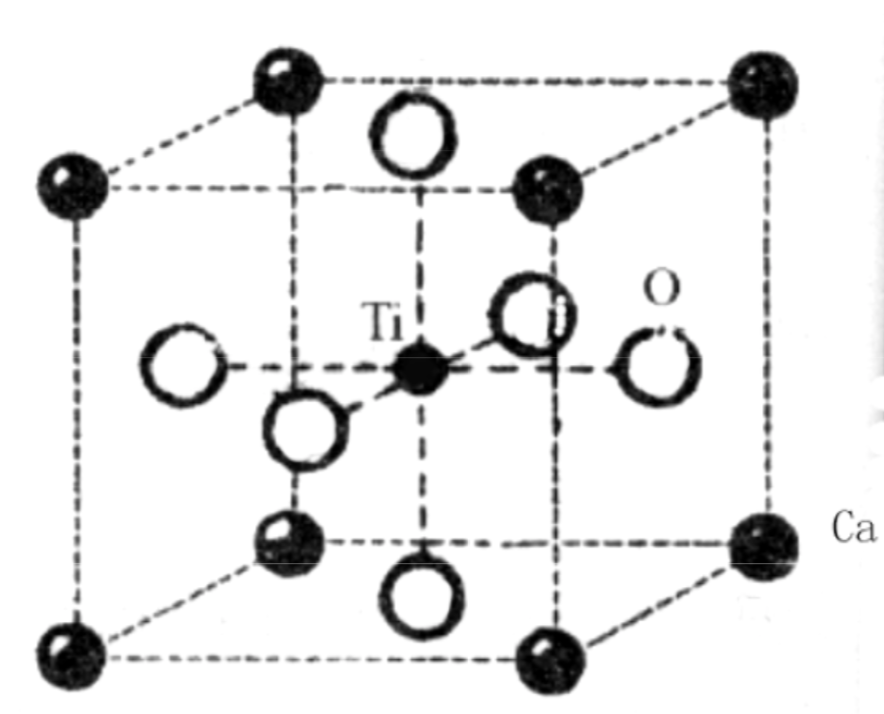

 </script>
 <!--  -->
 
 $$
    \newcommand{\pfrac}[2]{\frac{\partial #1}{\partial #2}}
    \newcommand{\embrace}[3]{\left #1 #2 \right #3}
    \newcommand{\embracesmall}[1]{\embrace{(}{#1}{)}}
    \newcommand{\embracemedium}[1]{\embrace{[}{#1}{]}}
    \newcommand{\qstate}[1]{\embrace{|}{#1}{>}}
    \newcommand{\d}[0]{\textrm{d}}
    \newcommand{\tqstate}[1]{\embrace{<}{#1}{|}}
    \newcommand{\thermalpartial}[3]{\embracesmall{\pfrac{#1}{#2}}_{#3}}
    \newcommand{\dfrac}[2]{\frac{\d #1}{\d #2}}
    \newcommand{\b}[1]{\boldsymbol{#1}}
 $$

固体物理笔记
====
<!-- MarkdownTOC -->

- [绪论](#%E7%BB%AA%E8%AE%BA)
    - [范式](#%E8%8C%83%E5%BC%8F)
        - [周期结构中波的传播问题](#%E5%91%A8%E6%9C%9F%E7%BB%93%E6%9E%84%E4%B8%AD%E6%B3%A2%E7%9A%84%E4%BC%A0%E6%92%AD%E9%97%AE%E9%A2%98)
        - [从头计算](#%E4%BB%8E%E5%A4%B4%E8%AE%A1%E7%AE%97)
- [晶体结构](#%E6%99%B6%E4%BD%93%E7%BB%93%E6%9E%84)
    - [元胞](#%E5%85%83%E8%83%9E)
        - [Miller 指数](#miller-%E6%8C%87%E6%95%B0)
    - [点群](#%E7%82%B9%E7%BE%A4)
        - [对称性操作](#%E5%AF%B9%E7%A7%B0%E6%80%A7%E6%93%8D%E4%BD%9C)
        - [点群](#%E7%82%B9%E7%BE%A4-1)
        - [Bravis格子](#bravis%E6%A0%BC%E5%AD%90)
        - [最密堆积](#%E6%9C%80%E5%AF%86%E5%A0%86%E7%A7%AF)
    - [典型晶体结构](#%E5%85%B8%E5%9E%8B%E6%99%B6%E4%BD%93%E7%BB%93%E6%9E%84)
- [周期结构中波的传播问题](#%E5%91%A8%E6%9C%9F%E7%BB%93%E6%9E%84%E4%B8%AD%E6%B3%A2%E7%9A%84%E4%BC%A0%E6%92%AD%E9%97%AE%E9%A2%98-1)
- [倒格子的计算](#%E5%80%92%E6%A0%BC%E5%AD%90%E7%9A%84%E8%AE%A1%E7%AE%97)
- [布拉格定律（晶体结构）](#%E5%B8%83%E6%8B%89%E6%A0%BC%E5%AE%9A%E5%BE%8B%EF%BC%88%E6%99%B6%E4%BD%93%E7%BB%93%E6%9E%84%EF%BC%89)
    - [原子散射因子](#%E5%8E%9F%E5%AD%90%E6%95%A3%E5%B0%84%E5%9B%A0%E5%AD%90)
    - [几何结构因子](#%E5%87%A0%E4%BD%95%E7%BB%93%E6%9E%84%E5%9B%A0%E5%AD%90)
- [晶体结合](#%E6%99%B6%E4%BD%93%E7%BB%93%E5%90%88)
- [勒纳-琼斯势](#%E5%8B%92%E7%BA%B3-%E7%90%BC%E6%96%AF%E5%8A%BF)
- [弹性波在晶体中的传播](#%E5%BC%B9%E6%80%A7%E6%B3%A2%E5%9C%A8%E6%99%B6%E4%BD%93%E4%B8%AD%E7%9A%84%E4%BC%A0%E6%92%AD)
- [晶体振动](#%E6%99%B6%E4%BD%93%E6%8C%AF%E5%8A%A8)
- [一维单原子链](#%E4%B8%80%E7%BB%B4%E5%8D%95%E5%8E%9F%E5%AD%90%E9%93%BE)
- [一维双原子链](#%E4%B8%80%E7%BB%B4%E5%8F%8C%E5%8E%9F%E5%AD%90%E9%93%BE)
- [态密度函数](#%E6%80%81%E5%AF%86%E5%BA%A6%E5%87%BD%E6%95%B0)
- [固体热容的量子理论](#%E5%9B%BA%E4%BD%93%E7%83%AD%E5%AE%B9%E7%9A%84%E9%87%8F%E5%AD%90%E7%90%86%E8%AE%BA)
    - [Einstein模型](#einstein%E6%A8%A1%E5%9E%8B)
    - [Debye模型](#debye%E6%A8%A1%E5%9E%8B)
    - [晶格振动对热容的贡献的严格计算](#%E6%99%B6%E6%A0%BC%E6%8C%AF%E5%8A%A8%E5%AF%B9%E7%83%AD%E5%AE%B9%E7%9A%84%E8%B4%A1%E7%8C%AE%E7%9A%84%E4%B8%A5%E6%A0%BC%E8%AE%A1%E7%AE%97)
- [离子晶体的红外光学性质](#%E7%A6%BB%E5%AD%90%E6%99%B6%E4%BD%93%E7%9A%84%E7%BA%A2%E5%A4%96%E5%85%89%E5%AD%A6%E6%80%A7%E8%B4%A8)
    - [长光学声波的宏观运动方程](#%E9%95%BF%E5%85%89%E5%AD%A6%E5%A3%B0%E6%B3%A2%E7%9A%84%E5%AE%8F%E8%A7%82%E8%BF%90%E5%8A%A8%E6%96%B9%E7%A8%8B)
- [非简谐效应](#%E9%9D%9E%E7%AE%80%E8%B0%90%E6%95%88%E5%BA%94)
    - [晶格状态方程和热膨胀](#%E6%99%B6%E6%A0%BC%E7%8A%B6%E6%80%81%E6%96%B9%E7%A8%8B%E5%92%8C%E7%83%AD%E8%86%A8%E8%83%80)
- [晶格振动的实验观测](#%E6%99%B6%E6%A0%BC%E6%8C%AF%E5%8A%A8%E7%9A%84%E5%AE%9E%E9%AA%8C%E8%A7%82%E6%B5%8B)
- [金属自由电子论](#%E9%87%91%E5%B1%9E%E8%87%AA%E7%94%B1%E7%94%B5%E5%AD%90%E8%AE%BA)
- [Drude模型：自由电子经典理想气体](#drude%E6%A8%A1%E5%9E%8B%EF%BC%9A%E8%87%AA%E7%94%B1%E7%94%B5%E5%AD%90%E7%BB%8F%E5%85%B8%E7%90%86%E6%83%B3%E6%B0%94%E4%BD%93)
- [量子自由电子论（热统重叠）](#%E9%87%8F%E5%AD%90%E8%87%AA%E7%94%B1%E7%94%B5%E5%AD%90%E8%AE%BA%EF%BC%88%E7%83%AD%E7%BB%9F%E9%87%8D%E5%8F%A0%EF%BC%89)
- [金属热容和顺磁磁化率](#%E9%87%91%E5%B1%9E%E7%83%AD%E5%AE%B9%E5%92%8C%E9%A1%BA%E7%A3%81%E7%A3%81%E5%8C%96%E7%8E%87)
- [金属的热电子发射和接触电势](#%E9%87%91%E5%B1%9E%E7%9A%84%E7%83%AD%E7%94%B5%E5%AD%90%E5%8F%91%E5%B0%84%E5%92%8C%E6%8E%A5%E8%A7%A6%E7%94%B5%E5%8A%BF)
- [金属的交流电导率和光学性质](#%E9%87%91%E5%B1%9E%E7%9A%84%E4%BA%A4%E6%B5%81%E7%94%B5%E5%AF%BC%E7%8E%87%E5%92%8C%E5%85%89%E5%AD%A6%E6%80%A7%E8%B4%A8)
- [能带理论：电子在固体中的状态](#%E8%83%BD%E5%B8%A6%E7%90%86%E8%AE%BA%EF%BC%9A%E7%94%B5%E5%AD%90%E5%9C%A8%E5%9B%BA%E4%BD%93%E4%B8%AD%E7%9A%84%E7%8A%B6%E6%80%81)
- [Bloch定理](#bloch%E5%AE%9A%E7%90%86)
    - [Bloch函数的性质](#bloch%E5%87%BD%E6%95%B0%E7%9A%84%E6%80%A7%E8%B4%A8)
- [一维周期场中电子运动的近自由电子近似](#%E4%B8%80%E7%BB%B4%E5%91%A8%E6%9C%9F%E5%9C%BA%E4%B8%AD%E7%94%B5%E5%AD%90%E8%BF%90%E5%8A%A8%E7%9A%84%E8%BF%91%E8%87%AA%E7%94%B1%E7%94%B5%E5%AD%90%E8%BF%91%E4%BC%BC)
    - [微扰](#%E5%BE%AE%E6%89%B0)
        - [非简并微扰](#%E9%9D%9E%E7%AE%80%E5%B9%B6%E5%BE%AE%E6%89%B0)
        - [简并微扰](#%E7%AE%80%E5%B9%B6%E5%BE%AE%E6%89%B0)
- [紧束缚模型](#%E7%B4%A7%E6%9D%9F%E7%BC%9A%E6%A8%A1%E5%9E%8B)
- [晶体能带的对称性](#%E6%99%B6%E4%BD%93%E8%83%BD%E5%B8%A6%E7%9A%84%E5%AF%B9%E7%A7%B0%E6%80%A7)
    - [$E_n\(\vec{k}\)$的对称性](#%24e_nveck%24%E7%9A%84%E5%AF%B9%E7%A7%B0%E6%80%A7)
    - [图示](#%E5%9B%BE%E7%A4%BA)
- [能态密度和费米面](#%E8%83%BD%E6%80%81%E5%AF%86%E5%BA%A6%E5%92%8C%E8%B4%B9%E7%B1%B3%E9%9D%A2)
- [晶体中电子的运动](#%E6%99%B6%E4%BD%93%E4%B8%AD%E7%94%B5%E5%AD%90%E7%9A%84%E8%BF%90%E5%8A%A8)
- [Bloch电子的概念](#bloch%E7%94%B5%E5%AD%90%E7%9A%84%E6%A6%82%E5%BF%B5)
- [恒定电场下电子的运动](#%E6%81%92%E5%AE%9A%E7%94%B5%E5%9C%BA%E4%B8%8B%E7%94%B5%E5%AD%90%E7%9A%84%E8%BF%90%E5%8A%A8)
    - [k空间](#k%E7%A9%BA%E9%97%B4)
    - [实空间](#%E5%AE%9E%E7%A9%BA%E9%97%B4)
- [导体、绝缘体、半导体的能带论解释](#%E5%AF%BC%E4%BD%93%E3%80%81%E7%BB%9D%E7%BC%98%E4%BD%93%E3%80%81%E5%8D%8A%E5%AF%BC%E4%BD%93%E7%9A%84%E8%83%BD%E5%B8%A6%E8%AE%BA%E8%A7%A3%E9%87%8A)
- [在恒定磁场中的运动](#%E5%9C%A8%E6%81%92%E5%AE%9A%E7%A3%81%E5%9C%BA%E4%B8%AD%E7%9A%84%E8%BF%90%E5%8A%A8)
    - [恒定磁场中的准经典运动](#%E6%81%92%E5%AE%9A%E7%A3%81%E5%9C%BA%E4%B8%AD%E7%9A%84%E5%87%86%E7%BB%8F%E5%85%B8%E8%BF%90%E5%8A%A8)
    - [朗道能级](#%E6%9C%97%E9%81%93%E8%83%BD%E7%BA%A7)
        - [电子回旋共振](#%E7%94%B5%E5%AD%90%E5%9B%9E%E6%97%8B%E5%85%B1%E6%8C%AF)
        - [晶体中电子的有效质量近似](#%E6%99%B6%E4%BD%93%E4%B8%AD%E7%94%B5%E5%AD%90%E7%9A%84%E6%9C%89%E6%95%88%E8%B4%A8%E9%87%8F%E8%BF%91%E4%BC%BC)

<!-- /MarkdownTOC -->

# 绪论
凝聚态:由大量粒子组成，并且粒子间有很强相互作用的系统。

凝聚态物理学:从微观角度出发，研究由大量粒子(原子、分子、离子、电子)组成的凝聚态的结构、动力学 过程及其与宏观物理性质之间的联系的一门学科。

决定固体性质的因素
- 主要因素
    + 原子、分子结合方式
    + 空间排列方式
    + 相互作用力类型
    + 价电子的运动状态
- 次要因素
    + 形成固体的原子、分子种类

主要研究对象：晶体

固体物理中的两类问题: 理想完整晶体，近完整晶体；基态问题，低激发态问题;

## 范式

### 周期结构中波的传播问题
充分利用晶体结构中的平移对称性简化问题

重要工具：经由傅立叶变换得到的倒易空间（波矢空间）

波矢空间的基本单位：布里渊区

解决具体问题：布里渊区内部和边界上的能量波矢关系

### 从头计算
从最基本的物理定律出发，不依靠任何参数拟合来计算物质的电子结构

元激发：
- 物理上重要的是相对于基态的低激发态行为，这些态可以在相对低的温度和微弱的外场下就会被激发，是它们决定着固体的性质
- 低激发态往往具有特别简单的性质，比起其他状态来说，数学上可以做严格处理，而在物理上也容易被理解。

- Bloch子---周期势场屮的电子
- 声子--------—弹性波
- 等离子激元——集体电子波
- 磁振子-------自旋波
- 极化子-------电子+弹性波
- 激子--------电极化强度波
- 轨道子-------轨道波

# 晶体结构

## 元胞
一个晶格的周期重复单元称作点阵的 晶胞(unit cell)，最小周期重复单元称作原胞(Primitive cell)
以点阵基矢构成平移矢量，可以把原胞复制填满整个空间。

惯用晶胞是人们约定的能够反映点阵对称性特点的单位，它可能是点阵的一种原胞，也可能是非原晶胞，但体积一定是原胞的整数倍。

### Miller 指数
晶面的法向量方向向量（整数）

六角晶系中使用四轴定向，以凸显6次对称性的特征

表示方法
$$\\\{\overline110\\\}=(\overline101)+(\overline110)+(10\overline1)+\cdots$$

## 点群

### 对称性操作

|操作|国际标准记号|熊夫利记号
|--|--|--|--
|旋转某个轴旋转$\frac{2\pi}{n}$及其整数倍|$n$|$C_n$
|反演：以某个点为中心进行中心对称操作|$i$|$C_i$
|反映：以某平面做镜面反演|$m$|$\sigma$
|旋转反演:绕某个轴旋转$\frac{2\pi}{n}$再做反演操作|$\overline{n}$|$S_n$

例：$H_2O:\\,C_{2v}$</img>

可以证明不论任何晶体，它的宏观对称元 素最多只可能有10种对称元素:
$$1,2,3,4,6,\overline1,\overline2,\overline3,\overline4,\overline6\qquad\overline3=3+i,\overline6=3+m,\overline2=m$$

一说8种：
$$1,2,3,4,6,i,m,\overline4$$

### 点群
|群|记号|解释
|--|--|--
|循环群|$C_n$|该群有一个n次旋转轴
|二面体群|$D_n$|一根n次旋转轴和n根垂直于这根主轴的二重轴
||$S_n$|表示一根只含有n次旋转反映轴（简称映轴）
|四面体|$T$|表示这个群有四面体的对称性
|八面体|$O$|表示该群具有八面体或者立方体的对称性

|脚标|解释
|--|--
|h|垂直于n次轴（主轴）的水平面为对称面
|v|含n次轴（主轴）在内的竖直对称面
|d|垂直于主轴的两个二次轴的平分面为对称面

### Bravis格子
|Bravis格子|解释
|--|--
|P|简单格子
|C|底心格子
|I|体心格子
|F|面心格子
|R|三方晶系的菱形格子

### 最密堆积
- 六角密排(hcp)
    + 不是Bravis格子
    + 高/边=$c/a\simeq1.633$
- fcc
    + 是Bravis格子

晶格
简单晶格：重复单元包含1个原子

复式晶格：重复单元包含多个原子

## 典型晶体结构

- A: 元素晶体
    + A1 fcc($\textrm{Cu}$)
        * $O_h^5(F_{m3m})$
        * $\textrm{Ag,Au,Ni,Al,Pb,Pd,Pt}$
        * 固态稀有气体元素
    + A2 bcc($\textrm{W}$)
        * $O_h^9(I_{m3m})$
        * 碱金属
    + A3 hcp($\textrm{Mg}$)
        * $D_{6h}^4 P6_3/mmc$
        * 惯用晶胞
             </img>
        * $\frac c a = 1.633$
    + A4 金刚石结构
        * $(0,0,0)\textrm{fcc}+(\frac14,\frac14,\frac14)\textrm{fcc}$
        * $O_h^7(F_{d3m})$
        * 晶格位置：$000,0 \frac{1}{2} \frac{1}{2}, \frac{1}{2} 0 \frac{1}{2}, \frac{1}{2} \frac{1}{2} 0,\frac{1}{4} \frac{1}{4} \frac{1}{4}, \frac{3}{4} \frac{3}{4} \frac{1}{4}, \frac{3}{4} \frac{1}{4} \frac{3}{4}, \frac{1}{4} \frac{3}{4} \frac{3}{4}$
- B: AB型化合物
    + B1 $\textrm{NaCl}$
        * $(0,0,0)\textrm{fcc(Na}^+\textrm{)}+(\frac12,\frac12,\frac12)\textrm{fcc(Cl}^-\textrm{)}$
        * $O_h$
        * 八面体群
            </img>
    + B2 $\textrm{CsCl}$
        * $(0,0,0)\textrm{sc(Cs}^+\textrm{)}+(\frac12,\frac12,\frac12)\textrm{sc(Cl}^-\textrm{)}$
        * $O_h^1(P_{m3m})$
    + B3 闪锌矿(立方ZnS)结构
        * $(0,0,0)\textrm{fcc(Zn)}+(\frac14,\frac14,\frac14)\textrm{fcc(S)}$
        * 与金刚石结构相同，基元为ZnS分子
        * $T_d^2(F_{\overline{4}3m})$
    + B4 纤锌矿(六角ZnS)结构
        * $(0,0,0)\textrm{hcp}+(0,0,\frac38)\textrm{hcp}$
        * $C_{6v}^4(P6_3mc)$
- C: $\textrm{AB}_\textrm{2}$型化合物
    + C1 萤石及反萤石结构($\textrm{CaF}_\textrm{2}$)
        * 整体结构：fcc
        * $O_h^5(F_{m3m})$
        * $\begin{array}{l}{Ca^{2+}:\\,(0,0,0)}\\\\{F^-:\\,(\frac14,\frac14,\frac14),(\frac14,\frac14,\frac34)}\end{array}$
        * </img>
    + C2 黄铁矿($\textrm{FeS}_\textrm{2}$)
    + C3 赤铜矿($\textrm{Cu}_\textrm{2}\textrm{O}$)
        * sc
        * $\begin{array}{ll}{\mathrm{O}^{-2} :} & {000, \frac{1}{2} \frac{1}{2} \frac{1}{2}} \\ {\mathrm{Cu}^{+1} :} & {\frac{1}{4} \frac{1}{4} \frac{3}{4}, \frac{1}{4} \frac{3}{4} \frac{1}{4}, \frac{3}{4} \frac{1}{4} \frac{1}{4}, \frac{3}{4} \frac{3}{4} \frac{3}{4}}\end{array}$
        * $O_{h}^{4}(P n 3 m)$
        * </img>
- E: $\textrm{CaTiO}_3$钙钛矿
    + sc
    + $O_h^1(P_{m3m})$
    + 每个基元有5个原子，各自组成简立方点阵，相互套构叠加而成
    + </img>

# 周期结构中波的传播问题

# 倒格子的计算
晶胞的基矢是原胞的边矢量
$$\vec{a_i}\cdot\vec{b_j}=2\pi\delta_{ij}$$
$$
\begin{array}{c}
{\vec{b_1}=2\pi\frac{\vec{a_2}\times\vec{a_3}}{\Omega}}\\\\
{\vec{b_2}=2\pi\frac{\vec{a_3}\times\vec{a_1}}{\Omega}}\\\\
{\vec{b_3}=2\pi\frac{\vec{a_1}\times\vec{a_2}}{\Omega}}\\\\
{\Omega = \vec{a_1}\cdot(\vec{a_2}\times\vec{a_3})}
\end{array}
$$

$$
\Omega^\*=\vec{b_1}\cdot(\vec{b_2}\times\vec{b_3})=\frac{(2\pi)^3}{\Omega}
$$

布里渊边界方程$$2\vec{k}\cdot\vec{G_h}=G_{h}^{2}$$

# 布拉格定律（晶体结构）
$$2d_{hkl}\sin\theta=n\lambda$$
利用了晶体中例子的衍射（衍射方向与反射相同）其中$d_{hkl}$是两个平行晶面$(hkl)$之间的距离，当符合条件时，产生亮条纹

Laue(劳厄)衍射条件：当入射波矢和散射波矢相差一个倒格矢矢量时发生衍射

$\vec{k_0}-\vec{k_1}=\vec{G_{HKL}}$ (劳厄方程)

因为光波长不变故有$k_0=k_1$，使劳厄方程等效于布里渊边界方程

## 原子散射因子
$$f(K)=\int\rho(\vec{r})e^{i\vec{K}\cdot\vec{r}}\textrm{d}^3 r$$

## 几何结构因子
$$F_{\vec{K}}=\sum_{i=1}^n e^{j\vec{K}\cdot\vec{R_i}}$$
$x_i,y_i,z_i$为晶胞内原子坐标

晶体结合
=========
每个离子的马德隆能$\frac{1}{2} \sum_{n 1, n 2, n 3} \frac{q^{2}(-1)^{n_{1}+n_{2}+n_{3}}}{4 \pi \varepsilon_{0}\left(n_{1}^{2} r^{2}+n_{2}^{2} r^{2}+n_{3}^{2} r^{2}\right)^{1 / 2}}$

每个原胞的马德隆能$\sum_{n 1, n 2, n 3} \frac{q^{2}(-1)^{n_{1}+n_{2}+n_{3}}}{4 \pi \varepsilon_{0}\left(n_{1}^{2} r^{2}+n_{2}^{2} r^{2}+n_{3}^{2} r^{2}\right)^{1 / 2}}$

$$
\begin{array}{l}{\sum_{n 1, n 2, n 3} \frac{q^{2}(-1)^{n_{1}+n_{2}+n_{3}}}{4 \pi \varepsilon_{0}\left(n_{1}^{2} r^{2}+n_{2}^{2} r^{2}+n_{3}^{2} r^{2}\right)^{1 / 2}}} \\\\ {=\frac{q^{2}}{4 \pi \varepsilon_{0} r}\left[\sum \frac{(-1)^{n_{1}+n_{2}+n_{3}}}{\left(n_{1}^{2}+n_{2}^{2}+n_{3}^{2}\right)^{1 / 2}}\right]} \\\\ {=-\frac{a q^{2}}{4 \pi \varepsilon_{0} r}}\end{array}
$$
a被称为马德隆常数，马德隆常数为一个发散的数值，需要用特别的数学方法来计算，取决于晶体结构

# 勒纳-琼斯势
$$
u(r)=-\frac{a}{r^{6}}+\frac{b}{r^{12}}
$$
对单个原子，也写为
$$
u(r)=4 \varepsilon\left[\left(\frac{\sigma}{r}\right)^{12}-\left(\frac{\sigma}{r}\right)^{6}\right]
$$

# 弹性波在晶体中的传播
弹性模量：立方晶系：$E=\frac{1}{3}\left(c_{11}+2 c_{12}\right)$
$$E:=\frac{\frac{\textrm{d}F}{S}}{\frac{\textrm{d}L}{L}}$$

晶体振动
==============
色散关系：频率$\omega$与波数$q=\frac{2\pi}{\lambda}$的关系

- 均匀介质 $\omega=\sqrt{\frac{E}{\rho}} q$
    + E为弹性模量
    + $\rho$为介质线密度

# 一维单原子链
只考虑最近邻相互作用

- $\omega=2 \sqrt{\frac{\beta}{m}}\left|\sin \frac{1}{2} a q\right|$
    + $\beta$为恢复力常数
    + m为粒子质量
    + 分立原子集体振动形成的格波与连续介质中的弹性波相比，色散关系发生了色散，偏离了线性关系，而且具有周期性和反射对称性
    + 波动解 $u_{n q}=A e^{i(\omega t-n a q)}$(格波)
        * q只需在第一布里渊区内取值即可

周期性边界条件(Born-Karman): 将一有限长度的晶体链看成无限长 晶体链的一个重复单元, $u_{N+n}=u_n$

相速度：$v_p=\lambda\cdot f=\frac\omega q$

群速度：$v_q=\frac{\textrm{d}\omega}{\textrm{d}q}$

长波极限：$q\to 0$时，格波就是弹性波。$q\to 0, \omega \to 0$的色散关系称为声学支，每组$(\omega,q)$对应的振动模式称为声学模

随着q的增长，ω数值逐渐偏离线性关系，变得平缓，在布里渊区边界$q\to \pm\frac\pi a$，格波频率达到极大值。群速度为0:反射波和入射波同位相，形成驻波，是入射波的波动性和晶格的周期性产生的结构

# 一维双原子链
只考虑最近邻相互作用

$$\left\\\{\begin{aligned} M \frac{\mathrm{d}^{2} u_{2 n}}{\mathrm{d} t^{2}} &=\beta\left(u_{2 n+1}+u_{2 n-1}-2 u_{n}\right) \\\\ m \frac{\mathrm{d}^{2} u_{2 n+1}}{d t^{2}} &=\beta\left(u_{2 n}+u_{2 n+2}-2 u_{2 n+1}\right) \end{aligned}\right.$$

色散关系：
$$
\omega_{ \pm}^{2}=\frac{\beta}{m M}\left[(m+M) \pm\left(m^{2}+M^{2}+2 m M \cos 2 q a\right)^{\frac{1}{2}}\right]
$$
$\omega_-$为声学支，$\omega_+$为光学支（在$\omega=\omega_+$附近有强烈的光吸收）

# 态密度函数
$g(\omega):=\lim_{\Delta\omega\to 0}\frac{\Delta n}{\Delta \omega}$

在q空间$\omega(q)-\omega+\d \omega$之间的振动模式数为$\d n=\frac{V}{(2 \pi)^{3}} \d V_{q}$

所以态密度表达式
$$
g(\omega)=\frac{V}{(2 \pi)^{3}} \iint_{S_{o}} \frac{d S_{q}}{\left|\nabla_{q} \omega(q)\right|}
$$

- 一维：$g(\omega)=\frac{d n}{d \omega}=\frac{L}{2 \pi} \frac{d q}{d \omega}$
- 三维长声学波：$g(\omega)=\frac{V}{2 \pi^{2}} \cdot \frac{\omega^{2}}{v_{s}^{3}}$

Note: 晶体中原子的任何运动都可以分解为它所允许的简谐波的叠加。

# 固体热容的量子理论

## Einstein模型
$$
\epsilon_i=(n_i+\frac12)\hbar\omega_i
$$

$$
\overline{\varepsilon_i}=\frac{\hbar \omega_{i}}{2}+\frac{\hbar \omega_{i}}{e^{\hbar \omega_{i} / k_{B} T}-1}
$$

所以

$$
C_{V}=\frac{\partial \overline{E}}{\partial T}=3 N k_{B}\left[\left(\frac{T_{E}}{T}\right)^{2} \frac{e^{\frac{T_{E}}{T}}}{\left(e^{\frac{T_{E}}{T}}-1\right)^{2}}\right]=3 N k_{B} f_{E}\left(\frac{T_{E}}{T}\right)
$$

以上推导是基于晶体共有N个原胞而每个原胞只有一个原子的情形。对于晶体共有N个原胞而每个原胞有n个原子的情形，则有:

$$
C_{V}=3 n N k_{B}\left(\frac{T_{E}}{T}\right)^{2} \frac{e^{\frac{T_{E}}{T}}}{\left(e^{\frac{T_{E}}{T}}-1\right)^{2}}=3 n N k_{B} f_{E}\left(\frac{T_{E}}{T}\right)
$$

## Debye模型
假设晶体是连续弹性介质，原子的热运动 以弹性波的形式发生，每一个弹性波振动模式等价于一个谐 振子，能量是量子化的，并规定了一个
弹性波频率上限$\omega_{D}$，称之为德拜频率。

由 N 个原胞(每个原胞只有一个原子)组成的晶体其自 由度为 3N，所以只能有3N 种振动模式.故：

$$
\int_{0}^{\omega_{D}} g(\omega) \mathrm{d} \omega=3 N
$$

代入三维弹性波的态密度得到：
$$
\omega_{D}=\left(\frac{6 N \pi^{2} v_{s}^{3}}{V}\right)^{\frac{1}{3}}=\left(6 \pi^{2} n\right)^{\frac{1}{3}} v_{s}
$$

定义德拜温度、德拜半径
$$
T_{D}=\frac{\hbar \omega_{D}}{k_{B}} \qquad q_{D}=\frac{\omega_{D}}{v_{s}}=\left(6 \pi^{2} n\right)^{\frac{1}{3}}
$$

$$
\overline{E}=\sum_{i=1}^{3 N} \overline{\varepsilon_i}=\sum_{i=1}^{3 N} \frac{\hbar \omega_{i}}{e^{\hbar \omega_{i}/k_{B} T}-1}=\int_{0}^{\omega_{D}} g(\omega) \frac{\hbar \omega}{e^{\hbar \omega/k_{B} T}-1} \mathrm{d} \omega
$$

核心：对$\omega$的求和改为积分（$\sum_i f(\omega_i)\to\int$）

## 晶格振动对热容的贡献的严格计算

$$
\overline{\varepsilon_j}=\left(\overline{n_j}+\frac{1}{2}\right) \hbar \omega_{j} \qquad \overline{n_j}=\frac{1}{\exp \left(\frac{\hbar \omega_{1}}{k_{s} T}\right)-1}
$$

# 离子晶体的红外光学性质

## 长光学声波的宏观运动方程
光学支q=0时的频率
$$
\omega_{\mathrm{TO}}^{2}=2 \beta \frac{M_{-}+M_{+}}{M_{-} M_{+}}=\frac{2 \beta}{\mu}
$$

运动：
$$
\left\\\{
\begin{aligned} 
u_{0+} &=\frac{e^{\*} E_{0}}{M_{+}\left[2 \beta\left(\frac{M_{-}+M_{+}}{M_{+} M_{-}}\right)-\omega^{2}\right]}=\frac{e^{\*} E_{0}}{M_{+}\left(\omega_{\mathrm{TO}}^{2}-\omega^{2}\right)} \\\\
u_{0-} &= \frac{-e^{\*} E_{0}}{M_{-}\left(\omega_{\mathrm{TO}}^{2}-\omega^{2}\right)} 
\end{aligned}
\right.
$$

$$
\varepsilon_{r}(\omega)=\varepsilon_{r}(\infty)+\frac{\varepsilon_{r}(0)-\varepsilon_{r}(\infty)}{1-\left(\frac{\omega}{\omega_{\mathrm{TO}}}\right)^{2}}
$$

LST关系式
$$
\frac{\omega_{L}^{2}}{\omega_{T}^{2}}=\frac{\varepsilon_{r}(0)}{\varepsilon_{r}(\infty)}
$$

介质的反射率
$$
R=\frac{(n-1)^{2}+k^{2}}{(n+1)^{2}+k^{2}}
$$

电磁波在晶体中传播时：
$$
\omega^{2}\left[\varepsilon_{r}(\infty)+\frac{\varepsilon_{r}(0)-\varepsilon_{r}(\infty)}{1-\omega^{2} / \omega_{T}^{2}}\right]=c^{2} q^{2}
$$
该方程代表两支色散关系，对于给定的 q 值，频率ω 的 根有两个，所以改变 q 值时，两个根给出两支分离的色散曲 线。它们既不和纯光子的色散曲线相符，也不和声子色散曲 线相符，事实上，这里描述的模式既不是纯光子，也不是纯 声子，而是光子-声子混合物:取名叫极化激元，或称电磁 激元。

黄昆方程
$$
w:=\left(\frac{\mu}{\Omega}\right)^{\frac{1}{2}}\left(u_{+}-u_{-}\right)
$$
w是描述长光学波的宏观量
$$
\begin{aligned} \ddot{w} &=-\frac{\partial H}{\partial w}=b_{11} w+b_{12} E \\\\ P &=-\frac{\partial H}{\partial E}=b_{12} w+b_{22} E \end{aligned}
$$

# 非简谐效应
势能的三阶展开及以上为非简谐项

简正坐标
$$\sqrt{m_i}u_i=\sum_{j=1}^{3N}a_{ij}Q_j$$

晶格热传导：声子扩散运动的结果
$$\kappa=\frac13C_V\lambda\overline{v_s}$$

声子碰撞：服从能量动量守恒
$$
\hbar\omega_1+\hbar\omega_2=\hbar\omega_3 \\\\
\begin{array}{lr}
\hbar\vec{q_1}+\hbar\vec{q_2}=\hbar\vec{q_3} & {正常过程} \\\\
\hbar\vec{q_1}+\hbar\vec{q_2}=\hbar\vec{q_3}+\hbar\vec{G} & {倒逆过程}
\end{array}
$$

- 正常过程：$q_3$在第一布里渊区内
    + 正常过程并没有使动量衰减，系统总的动量不变，定向运动没有被衰减。
    + 正常运动对实现热平衡没有贡献
- 倒逆过程：$q_3$在第一布里渊区外。
    + 使得声子某方向动量发生倒转，衰减声子团动量，对固体热传导有贡献。

## 晶格状态方程和热膨胀
格林爱森Gruneishen近似状态方程
$$
p=-\thermalpartial{F}{V}{T}=-\frac{\d U_l}{\d V}+\gamma\frac{\overline{E}}{V}
$$

Gruneishen常数：
$$\gamma=-\frac{\d \ln \omega}{\d \ln V}$$

Gruneishen定律：($\alpha$为体胀系数，$K$为体弹性模量)
$$\alpha=\frac{\gamma}{K}\frac{C_V}{V}$$

# 晶格振动的实验观测
X射线散射：激发或吸收一个声子从而改变能量和动量，散射过程服从能量、动量守恒定律

$$
\begin{array}{l}
{\vec{k}=\vec{k_0}+\vec{q}} \\\\ 
{\Omega=\Omega_{0} \pm \omega(q)}
\end{array}
$$

$$
q=2 k_{0} \sin \theta=2 n \frac{\Omega_{0}}{c} \sin \theta
$$
$2\theta$是散射角，n是折射率

金属自由电子论
=============
真空中自由电子的色散关系：$\omega=\frac{\hbar k^{2}}{2 m}$

Ohm定律$$J=\sigma E$$
Wiedemann-Franz定律
$$L T=\frac{\kappa}{\sigma}$$

# Drude模型：自由电子经典理想气体

电子气密度：$$
n=N_{A} \times \frac{Z \rho_{m}}{A}
$$
Ohm定律：$\sigma=\frac{n e^{2} \overline{l}}{2 m \overline{v}}$

Wiedemann-Franz定律：$\kappa=\frac{1}{3} C_{V} \overline{v l}$

# 量子自由电子论（热统重叠）
自由电子气体，金属为深势阱

电子能量：$E(k)=\frac{\hbar^{2} k^{2}}{2 m}$。k为波矢$k_{x}=\frac{2 \pi}{L} n_{x}, k_{y}=\frac{2 \pi}{L} n_{y}, k_{z}=\frac{2 \pi}{L} n_{z}$

电子是费米子

电子填充的最高能级是费米能级

k空间态密度：
$$
\rho(k)=\frac{1}{\Delta \vec{k}}=\frac{V}{8 \pi^{3}}
$$
$$
N(E)=\frac{d \frac{Z(E)}{V}}{d E}=\frac{(2 m)^{\frac{3}{2}}}{2 \pi^{2} \hbar^{3}} \cdot E^{\frac{1}{2}}=C E^{\frac{1}{2}}
$$

$g(k)$: k到(k+dk)内的态密度

T=0K时费米能计算：计算总电子数
$$2 \cdot\left(\frac{4 \pi k_{F}^{3}}{3}\right) \cdot\left(\frac{V}{8 \pi^{3}}\right)=N$$
$$4\pi\int_{0}^{k_F}\rho(k)k^2\d k=\frac n2$$

$$
\begin{array}{rll}{n}&{=\int_{0}^{\infty} f(E) N(E) d E}\\\\{}&{=\int_{0}^{E_{0}^{0}} N(E) d E=\int_{0}^{E_{f}^{0}} C E^{\frac{1}{2}} d E=\frac{2}{3} C\left(E_{F}^{0}\right)^{\frac{3}{2}}} &{(T=0)}\\\\ {}&{=\frac{(2 m)^{\frac{3}{2}}}{3 \pi^{2} \hbar^{3}}\left(E_{F}^{0}\right)^{\frac{3}{2}}}\end{array}
$$
$$
N\left(E_{F}^{0}\right)=\frac{3}{2} \frac{n}{E_{t}^{0}}
$$

# 金属热容和顺磁磁化率
顺磁磁化率
$$
\chi_{0}=\frac{M}{H}=N\left(E_{F}^{0}\right) \mu_{0} \mu_{B}^{2}
$$
电导率的计算：$$
F=m \frac{\mathrm{d} v}{\mathrm{d} t}=\hbar \frac{\mathrm{d} k}{\mathrm{d} t}=-e\left(\varepsilon+\frac{1}{e} v \times B\right)
$$
$$
\frac{\mathrm{d} {k}}{\mathrm{d} t}=-\frac{e}{\hbar} {\varepsilon}
$$

# 金属的热电子发射和接触电势
热电子发射的电流密度
$$
j=A T^{2} \exp \left(-\frac{W}{k_{B} T}\right)
$$
W为功函数（脱出功）

# 金属的交流电导率和光学性质

能带理论：电子在固体中的状态
============
绝热近似：原子核不动

平均场近似：其余电子对一个电子的相互作用等价为一个不随时间变化的平均场

周期场近似：势场具有平移对称性

# Bloch定理
晶体中电子波函数应为如下形式：$\psi_{k}(r)=e^{i k \cdot r} u_{k}(r)$（Bloch函数）。其中u为周期函数

## Bloch函数的性质
$k'=k+G_n$与$k$在Bloch函数中等价

- 简约波矢：$k$在第一布里渊区内
- 广延波矢：$k$在整个空间内

# 一维周期场中电子运动的近自由电子近似
近自由电子近似：将周期场的影响当作微扰

空格模型：每个格子：0势场，平移对称性$E=\frac{\hbar^2k^2}{2m}$

在第一布里渊区中能量是波矢的多值函数

## 微扰

一二阶微扰项：
$$
\begin{array}{l}{E_{k}^{(1)}=\langle k|\Delta U| k\rangle} \\\\ { E_{k}^{(2)}=\sum_{k^{\prime} \neq k} \frac{\left|\left\langle k^{\prime}|\Delta U| k\right\rangle\right|^{2}}{E_{k}^{0}-E_{k}^{0}}}\end{array}
$$

### 非简并微扰
$$
\begin{aligned} H &=-\frac{\hbar^{2}}{2 m} \frac{\mathrm{d}^{2}}{\mathrm{d} x^{2}}+U(x) \\\\ &=-\frac{\hbar^{2}}{2 m} \frac{\mathrm{d}^{2}}{\mathrm{d} x^{2}}+U_{0}+\sum_{n \neq 0} U_{n} \exp \left(i \frac{2 \pi n x}{a}\right)=H_{0}+H^{\prime} \end{aligned}
$$
$$
\begin{array}{l}{H_{0}=-\frac{\hbar^{2}}{2 m} \frac{\mathrm{d}^{2}}{\mathrm{d} x^{2}}+U_{0}} \\ {H^{\prime}=\sum_{n \neq 0} U_{n} \exp \left(i \frac{2 \pi n x}{a}\right)}\end{array}
$$
一级近似：$E^{(1)}\_k=0$

二阶近似：
$$E_{k}^{(2)}=\sum_{k^{\prime} \neq k} \frac{\left|H_{k k}^{\prime}\right|^{2}}{E_{k}^{(0)}-E_{k^{\prime}}^{(0)}}$$

### 简并微扰

在$k$和$k'$接近布里渊区边界时
$$
\Psi^{(0)}=A \psi_{k}^{(0)}+B \psi_{k^{\prime}}^{(0)}=A \cdot \frac{1}{\sqrt{L}} e^{i k x}+B \cdot \frac{1}{\sqrt{L}} e^{i k^{\prime} x}
$$

$$
\left\\\{\begin{aligned} 
E_{+} & \approx E_{k^{\prime}}^{(0)}+\frac{\left|U_{n}\right|^{2}}{E_{k^{\prime}}^{(0)}-E_{k}^{(0)}} \\\\
 E_{-} & \approx E_{k}^{(0)}-\frac{\left|U_{n}\right|^{2}}{E_{k^{\prime}}^{(0)}-E_{k}^{(0)}} \end{aligned}\right.
$$
使原来能量较高的$k'$态能量升高，能量较低的$k$态能量降低，是两个态的能量差加大

由于周期场的微扰E(k)函数将在布里渊区边界$k=\pm n\pi/a$处出现不连续，能量突变为
$$
E_{g}=E_{+}-E_{-}=2\left|U_{n}\right|
$$

$E_n(k)$函数的三种图像

# 紧束缚模型
- 电子的波函数是单原子核情况的线性叠加
    + $$[-\frac{\hbar^2}{2m}\nabla^2+V(r-R_m)]\varphi_i(r-R_m)=\varepsilon_i\varphi_i(r-R_m)$$
    + $$\Phi(r)=\sum_ma_m\varphi_i(r-R_m)$$
    + $$[-\frac{\hbar^2}{2m}\nabla^2+U(r)]\Phi(r)=E\Phi(r)$$
    + $$\sum_{m} a_{m}\left[\varepsilon_{i}+U({r})-V\left({r}-{R_m}\right)\right] \varphi_{i}\left({r}-{R_m}\right)=E \sum_{m} a_{m} \varphi_{i}\left(r-{R_m}\right)
    $$
- 原子间距大于轨道半径
    + $$\int\varphi_{i}^\*(\b r-\b R_n)\varphi_i(\b r-\b R_m)\d \b r=\delta_{nm}$$

目标：求解$E$
$$J(\b R_n-\b R_m):=-\left<\varphi_i(\b r-(\b R_n-\b R_m))\right|U(\b r)-V(\b r)\left|\varphi_i(\b r)\right>$$
$$-\sum_ma_mJ(\b R_n-\b R_m)=(E-\varepsilon_i)a_n$$
解出$a_m$:
$$a_m=Ce^{i\b k\cdot \b R_m}$$

代回方程：
$$E-\varepsilon_i=-\sum J(\b R_n-\b R_m) e^{-i\b k\cdot(\b R_n-\b R_m)}$$

对于确定的${\b k}$，电子运动的波函数为

$$
\begin{aligned} 
E-\varepsilon_{i} &=-\sum_{m} J\left(\b R_n-\b R_m\right) e^{-i \b k\cdot\left(\b R_{n}-\b R_{m}\right)} \\\\
&=-\sum_{s} J\left(\b R_{s}\right) e^{-i k \cdot \b R_s} 
\end{aligned}\\\\
\b{R}\_s=\b{R}\_n-\b{R}\_{m} 
$$

能量本征值
$$E(k)=\varepsilon_{j}-\sum_s J\left(\b R_{s}\right) e^{-i\b k \cdot\b R_s}$$

一般只保留近邻项：
$$E({k})=\varepsilon_i-J_0-\sum_{{R}\_s=\textrm{近邻}}J({\b R\_s})\exp(-i\b k\cdot\b R_s)$$

# 晶体能带的对称性

## $E_n(\vec{k})$的对称性
- 平移对称性，周期为$\vec{G}_h$
    + 仅对同一能带而言
- 点群对称性$E_{n}(\vec{k})=E_{n}(\alpha \vec{k})$
    + $\alpha$为晶体所属点群的任意点对称操作
- 反演对称性$E_{n}(\vec{k})=E_{n}(-\vec{k})$

## 图示
k空间，由对称性将体积消减至不可约体积

对于一般位置的k，对于一般位置 k ，简约区中对称相关的波矢量数就等于点群的阶数。但若 k 在简约区 中的某些特殊位置(对称点、对称轴或对称面），则简约区中等价波矢量数就少于点群的阶数

CH20第13-19页

# 能态密度和费米面
费米面是固体物理中最重要的概念之一。在自由电子论中费米面的重要性在于:只有费米面附 近的电子才能参与热跃迁或输运过程，决定着晶体的各种物理性质。

单位体积能态密度：$$N(E)=\frac1V\dfrac{Z}{E}$$
$\d Z$为能量在 $E-E+dE$ 两等能面间的能态数(考虑了电子自旋)。

$$N(E)=\frac1V\dfrac{Z}{E}=\frac1{4\pi^3}\iint_{E=const}\frac{\d S}{\left|\nabla_kE(k)\right|}$$

晶体中电子的运动
==============

# Bloch电子的概念
在外场影响下晶体中的电子

波包：$\Phi(x,t)=\int_{k_0-\frac{\Delta k}{2}}^{k_0+\frac{\Delta k}{2}}e^{i(kx-\omega t)}u_k(x)\d k\approx u_{k_{0}}(x)\int_{k_0-\frac{\Delta k}{2}}^{k_0+\frac{\Delta k}{2}}e^{i(kx-\omega t)}\d k$

晶体中电子速度的一般表述：
$$v_n(\vec{k})\frac1\hbar\nabla_{\vec{k}}E_n(\vec{k})$$

意义：严格周期性晶体的电阻率为0，电子速度方向v为k空间中能量梯度的方向，

准动量：$\hbar k$，Bloch波不是动量算符的本征函数

加速度：
$$
\hbar\dfrac{\vec{k}}{t}=-e[\vec{E}(\vec{r},t)+\vec{v}_n(\vec{k})\times\vec{B}(\vec{r}, t)]
$$

有效质量：
$$m^\*=\frac{\hbar^2}{\dfrac{^2E}{k^2}}$$

$$\embracemedium{\frac 1{m^*}}_{ij}=\frac{1}{\hbar^2}\pfrac{^2E}{k_i\partial k_j}$$

电子有效质量常用电子比热数据计算得到：$\frac{\gamma_{exp}}{\gamma_0}=\frac{m^\*}{m}$，$\gamma_0$为自由电子的比热，$\gamma_{exp}$为实验值

# 恒定电场下电子的运动

## k空间
$\dfrac{k}{t}=\frac{e\varepsilon}{\hbar}$

k空间匀速运动，v沿E(k)曲线周期性变化

## 实空间
能带倾斜、电子在同一能带中震荡

# 导体、绝缘体、半导体的能带论解释

- 满带：全满
    + 不导电
- 导带：一部分被填满
    + 导电
- 近满带：少量未填充
    + 载流子：空穴

- 导体：导带
- 半导体：价带+空带（禁带窄）
- 绝缘体：价带+空带（禁带宽）

# 在恒定磁场中的运动

## 恒定磁场中的准经典运动
$$\left\\\{\begin{array}{l}\b{v}(k)=\frac1{\hbar}\nabla_{\b{k}} E(\b{k})\\\\\b{F}=-e\b{v}(\b{k})\times\b{B}=\hbar\dfrac{\b{k}}{t}\end{array}\right.$$
在只涉及外力时，晶体动量起着普通动量的作用

运动轨迹：磁场垂面和等能面的交线

回旋运动圆频率：$\omega_c=\frac{2\pi}{T}=\frac{2\pi eB}{\hbar\int_{E=const}\frac{\d \vec{k}}{\embrace{|}{v_\perp}{|}}}$

在能带顶和能带底，圆频率为Bloch电子的圆周运动的回旋圆频率（质量为有效质量）

## 朗道能级
根据量子理论，电子在垂直于磁场的平面内的匀速圆周运动对应于一种能量量子化的简谐运动。
这种量子化的能级为朗道能级。
$$E(\b{k})=\frac{\hbar^2k_{z}^2}{2m}+\varepsilon_n=\frac{\hbar^2k_{z}^2}{2m}+(n+\frac12)\hbar\omega_c$$

### 电子回旋共振
沿磁场方向输入交变电场，当电场$\omega=\omega_c$时，能量吸收最大

### 晶体中电子的有效质量近似
$$H=\frac1{2m}(\b{p}+e\b{A})^2+U(\b{r})=\frac1{2m^\*}(\b{p}+e\b{A})^2$$
